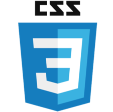

# Sovigation

### 1. Motivation

> The academic information required by students is **dispersed**. 
>
> So, we wanted to create a web that **could provide it at once**.

### 2. IDEA

> **Student Service Integration Management web page**

### 3. Structure

### 4. Technology

`Front-End`

|             HTML             | CSS                         |         JavaScript         |         Bootstrap          |
| :--------------------------: | :-------------------------- | :------------------------: | :------------------------: |
|  |  |  |  |

`Back-End`

| Framework | Database |
| --------- | -------- |
| Django    | MySQL    |

### 5. Overview

`Main Page`

`Login Page`

`Service Page`

`Grade Management`

`Assignment Management`

`Food Table`

`Library Seats`

`Board Page`

### 6. Member

